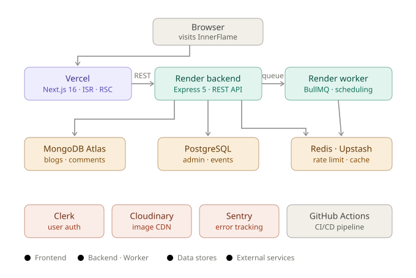
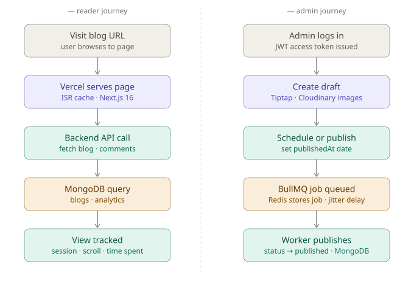
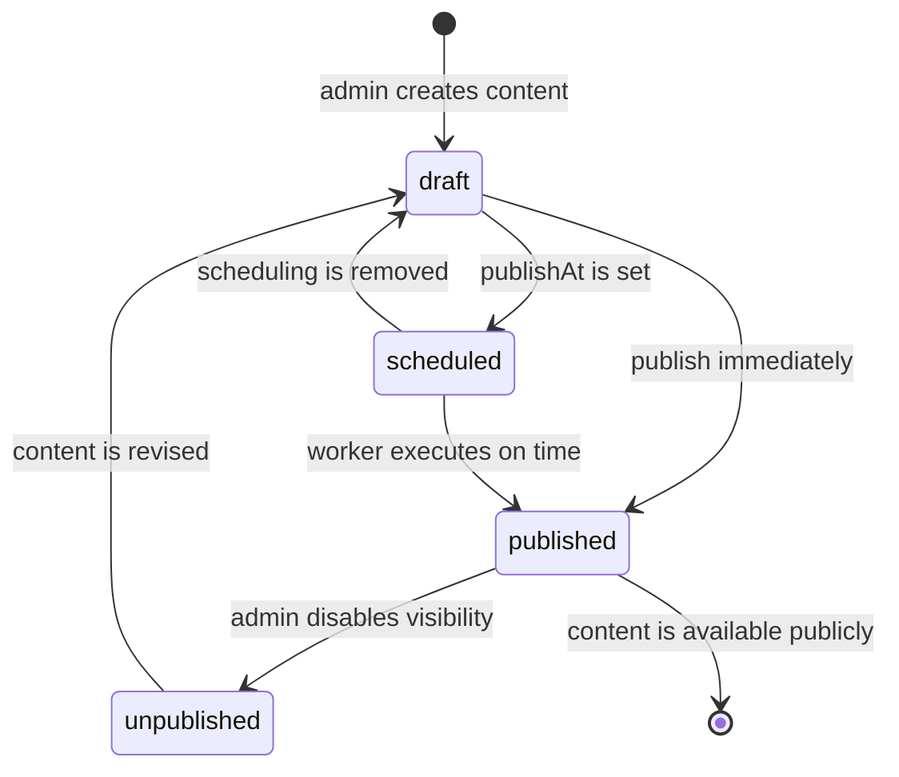
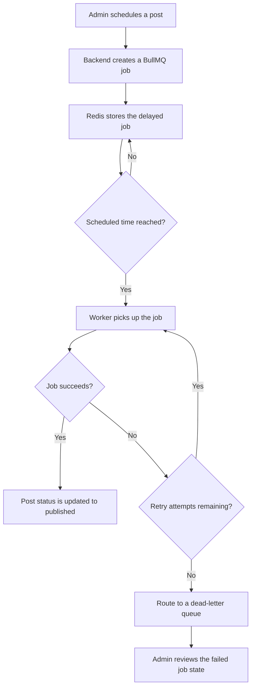
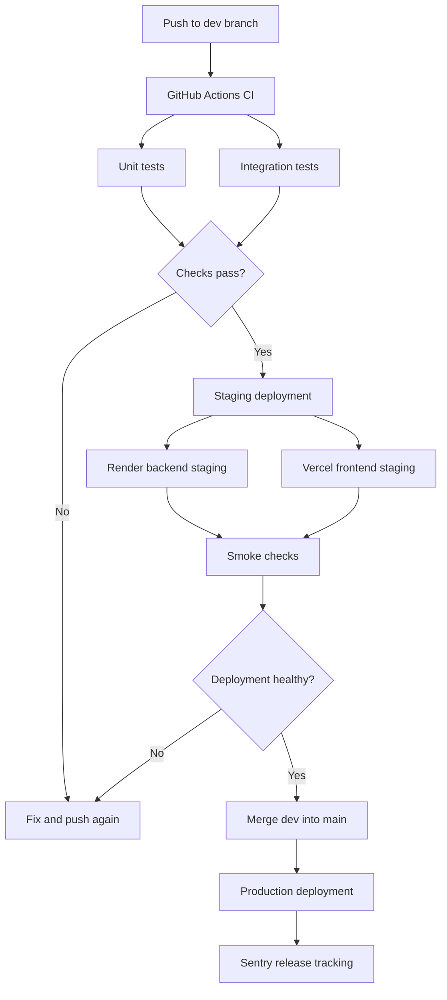

# InnerFlame

A full-stack personal publishing platform built for writing and sharing content across tech, life, and self-taught development journeys. It combines content creation, scheduled publishing, analytics, reader engagement, and production-style infrastructure in a single monorepo.

**Live demo →** [ https://the-blog-project-frontend-8mlz.vercel.app ]


---

## Table of Contents

* [Overview](#overview)
* [Features](#features)
* [Architecture](#architecture)
* [Main Flow](#main-flow)
* [Content Lifecycle](#content-lifecycle)
* [Background Jobs](#background-jobs)
* [CI/CD Pipeline](#cicd-pipeline)
* [Engineering Decisions](#engineering-decisions)
* [Screenshots](#screenshots)
* [Getting Started](#getting-started)
* [Environment Variables](#environment-variables)
* [Testing](#testing)
* [License](#license)

---

## Overview

InnerFlame was designed to explore what sits behind a real blog platform: how content is created, scheduled, stored, delivered, and measured. Beyond the visible UI, the project includes background job processing, separate frontend and backend concerns, shared packages in a monorepo, and operational workflows that support a more production-like system.

---

## Features

* Rich text editor with Tiptap
* Scheduled publishing with BullMQ
* Separate authentication for readers and admin
* Admin dashboard and content management
* Reader engagement features
* Search with pagination
* ISR-optimised public pages
* View tracking and Google Analytics
* Cloudinary image uploads
* Newsletter subscription workflow

---

## Architecture



### High-level layout

* **Frontend:** Next.js public site and admin interface
* **Backend:** API layer for content, auth, search, engagement, and analytics
* **Datastores:** MongoDB and PostgreSQL for domain-specific persistence
* **Cache / queue:** Redis for caching and job orchestration
* **Background worker:** BullMQ worker for delayed publishing and async tasks
* **Media layer:** Cloudinary for image storage and delivery
* **Auth:** Clerk for reader-facing auth, custom JWT flow for admin access
* **Observability:** Sentry and analytics hooks for runtime visibility
* **Delivery:** GitHub Actions, Render, Vercel, and Docker-based deployment paths

---

## Main Flow



### Primary user paths

* **Reader path:** open homepage → browse posts → search or filter content → read article → engage with post
* **Admin path:** sign in → create or edit draft → upload assets → preview content → publish immediately or schedule for later
* **Publishing path:** post created → validated → persisted → indexed for discovery → exposed publicly through the site

---

## Content Lifecycle



This lifecycle keeps content states explicit and makes publishing behavior easier to reason about across the editor, backend, and worker layers.

---

## Background Jobs



### Async processing use cases

* delayed publishing
* retry-aware processing
* failure isolation through dead-letter handling
* worker-based execution outside the request-response cycle

---

## CI/CD Pipeline



### Delivery goals

* keep mainline changes testable before merge
* validate backend and frontend separately
* reduce release risk with staging verification
* surface runtime issues quickly through observability hooks

---

## Engineering Decisions

### 1. Polyglot persistence: MongoDB + PostgreSQL

The data model is split by shape and responsibility. Blog content, comments, and analytics are document-oriented and benefit from MongoDB’s flexible schema. Admin accounts, refresh tokens, and audit-style records are relational and fit PostgreSQL well. Using both databases avoids forcing one system to handle workloads it is not naturally suited for.

### 2. Dual authentication: Clerk for readers, custom JWT for admin

Clerk handles reader authentication, session management, OAuth, and webhook-driven user sync. The admin surface has a narrower but stricter requirement set: a controlled login flow, lockout handling, refresh token rotation, and auditability. A custom JWT implementation with bcrypt and token storage in PostgreSQL gives direct control over those requirements without adding unnecessary complexity to the reader flow.

### 3. Separate worker service for scheduled publishing

Scheduled publishing is handled by a dedicated worker instead of an in-process cron task. BullMQ persists delayed jobs in Redis, so scheduled work survives backend restarts and process failures. Running the worker as a separate service also isolates async execution from the request-response API. Failed jobs are routed into a dead-letter path for inspection rather than disappearing silently.

### 4. ISR for public pages

The homepage and blog detail pages use ISR instead of client-only fetching. That allows pages to be served as pre-rendered HTML and refreshed in the background on a short interval. For a blog, that tradeoff works well: readers get fast initial loads, while published content remains fresh enough without forcing a full server render on every request.

### 5. pnpm workspaces in a monorepo

The frontend, backend, and worker share packages for config, logging, and database utilities. pnpm workspaces keep those shared modules in one codebase without publishing internal packages externally. This reduces duplication and keeps shared behavior consistent, while making the Docker build and deployment setup more explicit.

### 6. Health route before auth middleware

The `/health` endpoint is intentionally placed before authentication middleware so infrastructure checks can reach it without a token. Load balancers, container health checks, and smoke tests should not depend on app login state. This is a small implementation detail, but it matters operationally because middleware order determines request flow.

These decisions cover data modeling, authentication, async execution, rendering strategy, code organization, and operational reliability without overstating the scope of the project.

## Screenshots

Add screenshots here to show the product in action.

Suggested order:

* homepage
* post editor
* article page
* admin dashboard
* scheduling interface
* analytics or engagement views

Example:

```md


```

---

## Getting Started

### Prerequisites

* Node.js 20+
* pnpm 10.17.1
* Docker (for local databases)

### Local Setup

```bash
# Clone the repo
git clone https://github.com/SauravK57387127/the-blog-project.git
cd the-blog-project

# Install dependencies
pnpm install

# Start local databases
docker compose -f docker-compose.db.yml up -d

# Copy env file and fill in values
cp .env.example .env.development

# Run migrations
pnpm db:migrate

# Start frontend and backend in separate terminals
pnpm dev:frontend
pnpm dev:backend
```

### Docker Production Build

```bash
cp .env.example .env.docker
# fill in .env.docker with real values

docker compose --env-file .env.docker up --build
```

---

## Environment Variables

| Variable                            | Required | Description                         |
| ----------------------------------- | -------: | ----------------------------------- |
| `MONGO_URI`                         |      Yes | MongoDB connection string           |
| `DB_NAME`                           |      Yes | MongoDB database name               |
| `POSTGRES_DATABASE_URL`             |      Yes | PostgreSQL connection string        |
| `REDIS_URL`                         |      Yes | Redis connection string             |
| `CLERK_SECRET_KEY`                  |      Yes | Clerk backend secret key            |
| `CLERK_PUBLISHABLE_KEY`             |      Yes | Clerk publishable key               |
| `CLERK_WEBHOOK_SECRET`              |      Yes | Clerk webhook signing secret        |
| `ADMIN_JWT_SECRET`                  |      Yes | JWT secret for admin access tokens  |
| `ADMIN_JWT_REFRESH_SECRET`          |      Yes | JWT secret for admin refresh tokens |
| `CLOUDINARY_CLOUD_NAME`             |      Yes | Cloudinary cloud name               |
| `CLOUDINARY_API_KEY`                |      Yes | Cloudinary API key                  |
| `CLOUDINARY_API_SECRET`             |      Yes | Cloudinary API secret               |
| `SENTRY_DSN`                        |       No | Sentry error tracking DSN           |
| `NEXT_PUBLIC_CLERK_PUBLISHABLE_KEY` |      Yes | Clerk key exposed to the frontend   |
| `NEXT_PUBLIC_API_URL`               |      Yes | Backend URL used by the frontend    |
| `NEXT_PUBLIC_GA_MEASUREMENT_ID`     |       No | Google Analytics measurement ID     |
| `ENABLE_MONGO`                      |      Yes | Enable MongoDB connection           |
| `ENABLE_PRISMA`                     |      Yes | Enable PostgreSQL connection        |
| `ENABLE_REDIS`                      |      Yes | Enable Redis connection             |
| `ENABLE_CACHE`                      |       No | Enable response caching             |

---

## Testing

```bash
# Unit tests
pnpm test:unit

# Integration tests (requires Docker databases running)
pnpm test

# E2E tests (requires frontend running separately)
pnpm dev:frontend   # terminal 1
pnpm test:e2e       # terminal 2
```

| Suite       |                Tests | Coverage Area                         |
| ----------- | -------------------: | ------------------------------------- |
| Unit        |                    7 | Sanitization utilities                |
| Integration |                   83 | Public, user, and admin API endpoints |
| E2E         | 7 passing, 3 skipped | Reader journey, search, admin login   |

---

## License

MIT
